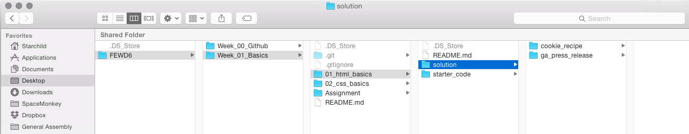
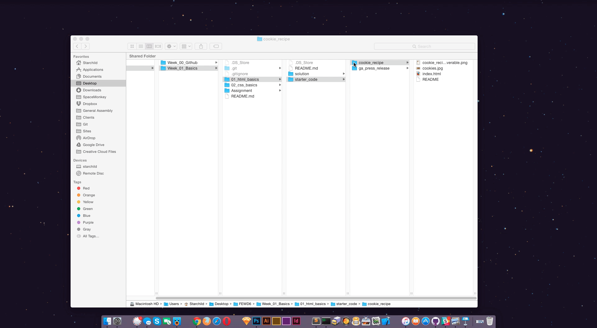
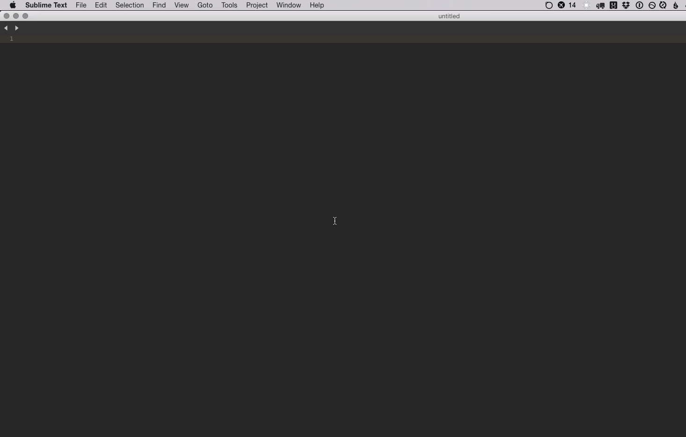

#Lesson 01 - HTML Basics

##LEARNING OBJECTIVES

* Review class objectives, Github workflow, and basic local development setup

*	Apply HTML tags ```<html><head><!DOCTYPE html><body>``` to a web page and experiment with html tags.

*	Describe the DOM and draw a simple DOM tree.

*	Be able to identify what tags certain content should get, and markup a basic document

###Local Development setup

It's important to stay organized and keep files and folders labeled properly. You would be surprised at how often someone wastes an hour or two trying to figure out why something isn't working just to realize they were working on a file in a wrong folder. When we are working on our forked coarse repos we should always be adding our work to a folder with the particular project name (for example `/ga_press_release`), which should always be placed in a `/solution` folder inside that lesson's folder, **so**, your folder structure will end up looking like this:


When beginning to work on a project in [Sublime Text](http://www.sublimetext.com/3), it is important that you open the entire project folder, so you can be certain that the files you are working on are all in the same project folder. You can do this either by dragging and dropping a project folder into the Sublime Text icon:


**Or** you can open Sublime Text and go to `file>open` and select the project **folder** instead of an individual file


###HTML Tags & CSS Selectors Review

 *	This section is a refresher for students. As pre-work we asked students to complete Project 1: ["Anna's Website"](https://dash.generalassemb.ly/projects/annas-website-1) in Dash. Review tag syntax (tags have opening and closing brackets etc.) Review CSS syntax. __NOTES: Students were only introduced to element selectors.__

===
 
 
###Adding Structure
_Time : 60min_

The goal of this section is to explain what it means to add "structure" to a document with HTML, and how to approach content. 

*	Thanks to Dash, students should be familiar with the rules of HTML tags. Adding HTML tags are generally easy for students to grasp. However, students get confused when it comes to knowing which tag to apply to content. To a human reader like yourself, text has meaning, we can read with an understanding of the text and express that in code. 


###GA Press Release

| Code along | |
| :------------- |:-------------|
| __Time__ | 30 min| 
| __Topics__ | HTML Tags, Nesting| 
| __Description__| This introductory code along meant to teach students how to read with understanding and apply the correct tag.|   
| __Notes__| Omit ordered list ```<ol>```, students will Google it during lab time.|  

===